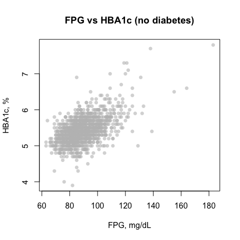
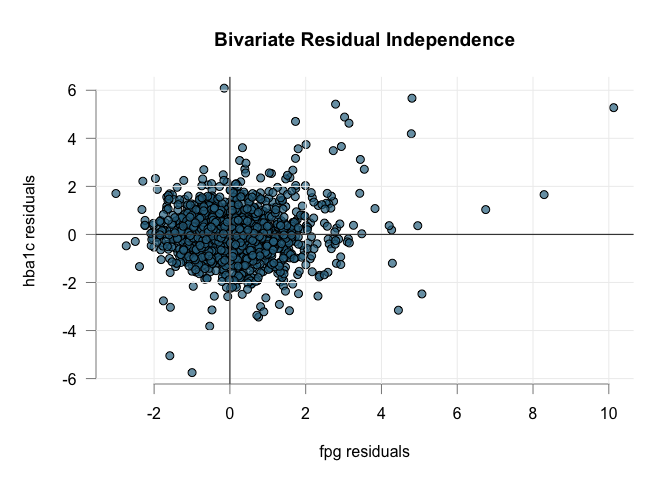
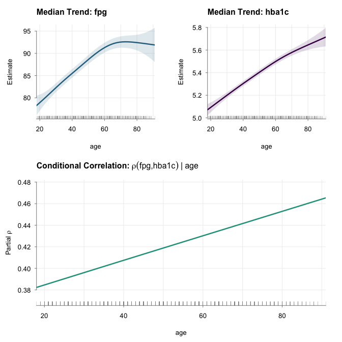
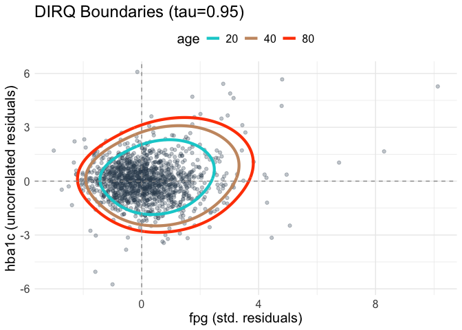
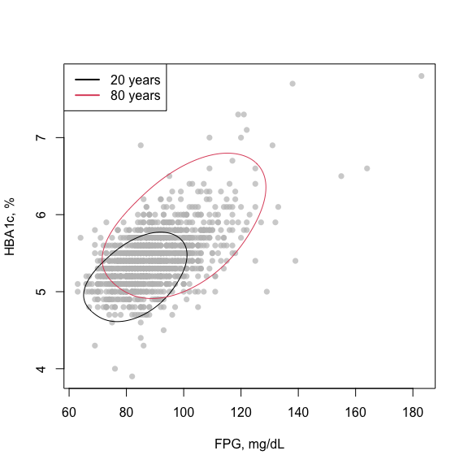
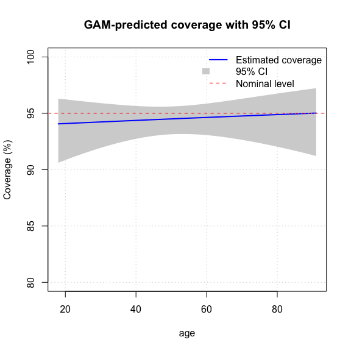

TwoDiRef: Conditional 2D Robust Reference Regions
================
Óscar Lado-Baleato \| Sara Rodríguez-Pastoriza \| Javier Roca Pardiñas
\| Francisco Gude
2026-03-15

# Overview

This document demonstrates the **TwoDiRef** workflow for building
conditional 2D reference regions using **median-based partial
correlation models** and **directional quantile regression**. The
example uses the `aegis` dataset from `refreg`, for subjects without
diabetes.

------------------------------------------------------------------------

# Load libraries and data

``` r
install.packages("remotes")
library(remotes)
install_github("Bioscar/TwoDiRef")
```

``` r
library(TwoDiRef)
library(refreg)

# Subset dataset: subjects without diabetes
no_dm <- subset(refreg::aegis, dm == "no")

# Quick scatter plot of the raw data
plot(no_dm$fpg, no_dm$hba1c, 
     main="FPG vs HBA1c (no diabetes)",
     xlab="FPG, mg/dL", ylab="HBA1c, %", pch=16, col=adjustcolor("grey", 0.6))
```



<figure>

<figcaption aria-hidden="true">Scatterplot glycemic markers</figcaption>
</figure>

------------------------------------------------------------------------

# Define formulas for the two responses

We define median models for **FPG** and **HBA1c** conditioned on `age`
using smooth terms:

``` r
f <- list(
  fpg   ~ s(age),
  hba1c ~ s(age)
)
f
```

    ## [[1]]
    ## fpg ~ s(age)
    ## 
    ## [[2]]
    ## hba1c ~ s(age)

------------------------------------------------------------------------

# Fit median-based partial correlation model

``` r
fit <- median_pcor(f=f, data=no_dm, qu=0.50)
```

    ## Estimating learning rate. Each dot corresponds to a loss evaluation. 
    ## qu = 0.5........done 
    ## Estimating learning rate. Each dot corresponds to a loss evaluation. 
    ## qu = 0.5........done 
    ## Estimating learning rate. Each dot corresponds to a loss evaluation. 
    ## qu = 0.5...........done

``` r
fit
```

    ## 
    ## Median-based Partial Correlation Model (via QGAM)
    ## --------------------------------------------------
    ## Quantile: 0.5
    ## Scale, MAD (fpg): 9.5041
    ## Scale, MAD (hba1c): 0.2600
    ## Number of observations: 1329
    ## Response variables: fpg and hba1c
    ## Covariates used: age
    ## 
    ## Models stored in components:
    ##   $mod.y1   -> Median of fpg conditioned on [age]
    ##   $mod.y2   -> Median of hba1c conditioned on [age]
    ##   $mod.pcor -> Correlation of hba1c ~ fpg adjusted by [age]
    ## 
    ## Data stored in components ($data):
    ##   $x.c      -> Residuals of fpg (centered & scaled)
    ##   $y.c      -> Residuals of hba1c (centered & scaled)
    ##   $y.c_res  -> Residuals of hba1c uncorrelated with fpg
    ## --------------------------------------------------

------------------------------------------------------------------------

# Plot residuals and effects

Visualize the **standardized residuals** and **median trends with
varying partial correlation**:

``` r
plot(fit, type="residuals", cex=1)
```



<figure>

<figcaption aria-hidden="true">Bivariate residuals</figcaption>
</figure>

``` r
plot(fit, type="effects", cex=1)
```



<figure>

<figcaption aria-hidden="true">Conditional medians and
correlations</figcaption>
</figure>

------------------------------------------------------------------------

# Fit conditional directional quantile reference region

We now construct the **bivariate reference region** at the 95% quantile:

``` r
region <- dirq(fit, qu=0.95, err=0.01)
```

    ## Fitting dirq boundary for tau = 0.95 using predictor: age

    ## Estimating learning rate. Each dot corresponds to a loss evaluation. 
    ## qu = 0.95............done

``` r
region
```

    ## 
    ## -- Directional Quantile Object (dirq) --
    ## Class:                 dirq
    ## Quantile (tau):        0.95
    ## Adjusted Predictor:    age
    ## Observations:          1329
    ## Model Complexity:      7.06 EDF
    ## Formula:               r ~ s(alpha, bs = "cc") + s(age)
    ## ----------------------------------------

------------------------------------------------------------------------

# Plot directional quantile region

``` r
plot(region, newdata = data.frame(age=c(20, 40, 80)))
```



<figure>

<figcaption aria-hidden="true">Estimated regions on residuals
scale</figcaption>
</figure>

Overlay on the observed data:

``` r
plot(no_dm$fpg, no_dm$hba1c, col=adjustcolor("grey",0.7),
     pch=16, cex=1,xlab="FPG, mg/dL", ylab="HBA1c, %")
lines(predict(region, newdata=data.frame(age=18)), type="l")
lines(predict(region, newdata=data.frame(age=80)), col=2)
legend("topleft",col=c(1,2),legend=c("20 years","80 years"),lwd=2,lty=1)
```



<figure>

<figcaption aria-hidden="true">Predicted reference regions</figcaption>
</figure>

------------------------------------------------------------------------

# Real data coverage of the estimated reference regions: k-fold cross-validation

Evaluate how well the directional quantile region covers the data:

``` r
cv_results <- cv_dirq_coverage(
  region, no_dm,
  fold_size = 100,
  verbose   = TRUE,
  quiet     = TRUE,
  plot_gam  = TRUE,
  ci        = TRUE,
  return_quartiles = TRUE
)
```

    ## Performing CV with 14 groups...
    ##   Processed group 5 of 14 
    ##   Processed group 10 of 14 
    ## 
    ## --- CV RESULTS ---
    ## Observed coverage: 94.51 %
    ## Expected coverage: 95 %



``` r
cv_results$overall_coverage
```

    ## [1] 94.51

``` r
cv_results$quartile_coverage
```

    ##              quartile coverage   n
    ## 1   Covariate[Q0-Q25)    94.19 344
    ## 2  Covariate[Q25-Q50)    94.78 345
    ## 3  Covariate[Q50-Q75)    93.67 316
    ## 4 Covariate[Q75-Q100)    95.37 324

``` r
head(cv_results$data)
```

    ##   id gender age dm fpg hba1c fru .coverage            quartile
    ## 1  1   male  47 no 101   6.0 222         1  Covariate[Q25-Q50)
    ## 2  2   male  43 no 101   5.4 247         1  Covariate[Q25-Q50)
    ## 5  5 female  72 no  89   5.3 220         1 Covariate[Q75-Q100)
    ## 6  6   male  67 no  97   5.8 196         1 Covariate[Q75-Q100)
    ## 7  7 female  62 no  81   5.1 267         1  Covariate[Q50-Q75)
    ## 8  8   male  61 no  95   5.4 230         1  Covariate[Q50-Q75)

<figure>

<figcaption aria-hidden="true">Reference region coverage</figcaption>
</figure>

------------------------------------------------------------------------

# Interactive Shiny application

Finally, launch an **interactive Shiny app** to explore how the
reference region evolves along `age`:

``` r
shiny_region(region, no_dm)
```

> **Note:** The Shiny app is interactive and cannot be rendered in a
> static HTML report.

------------------------------------------------------------------------

# Summary

This workflow demonstrates:

- Fitting **median-based partial correlation models** for two responses.
- Building **conditional 2D reference regions** via directional
  quantiles.
- Visualizing residuals, effects, and regions.
- Performing **cross-validation** to assess empirical coverage.
- Exploring results interactively with **Shiny**.

TwoDiRef provides a robust and interpretable framework for multivariate
reference regions, suitable for clinical or experimental datasets.
